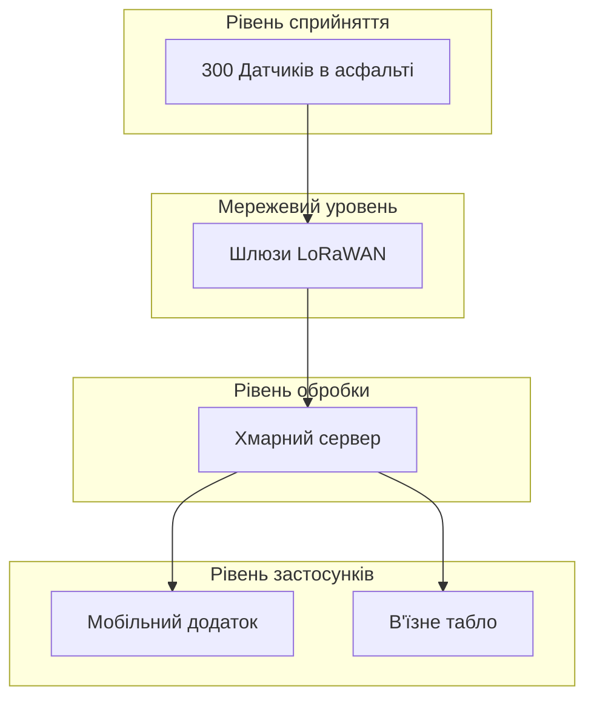

# Практична робота №1: Вступ до IoT
**Тема:** Проєкт «Розумне паркування» (Варіант 3)

## 1. Вибір датчиків для парковки
Для проєкту порівняно два типу датчиків для визначення наявності авто:
*   **Ультразвукові:** Кріпляться над кожним місцем, потребують багато дротів живлення, чутливі до бруду.
*   **Геомагнітні (Обрано):** Вкопуються в асфальт, працюють від вбудованої батарейки до 5 років, не бояться дощу та снігу.
 Обрано **геомагнітні датчики**, бо їх набагато простіше і дешевше встановити на 300 місць без прокладання кілометрів кабелю.

---

## 2. Мережа та шлюзи
*   **Протокол зв'язку:** Обрано **LoRaWAN**. Він споживає дуже мало енергії (датчики працюватимуть роками) і передає дані на велику відстань. Топологія — «Зірка».
*   **Розрахунок шлюзів:** Для 300 датчиків вистачило б і 1 шлюзу LoRaWAN, але мы беремо **2 шлюзи**. Другий потрібен для підстраховки (резерву), якщо перший зламається. Вони будуть стояти на ліхтарях по різних боках парковки.

---

## 3. Склад системи (Таблиця)

| Що це за пристрій | Що він робить | Де встановлений |
| :--- | :--- | :--- |
| **Датчик парковки (300 шт.)** | Перевіряє, чи стоїть машина на місці | В асфальті на кожному місці |
| **Шлюз LoRaWAN (2 шт.)** | Приймає сигнал від датчиків і шле в інтернет | На стовпах освітлення |
| **LED-табло (1 шт.)** | Показує водіям кількість вільних місць | При в'їзді на парковку |
| **Сервер (Хмара)** | Зберігає всі дані та рахує вільні місця | В інтернеті (хмарний хостинг) |

---

## 4. Де обробляються дані?
Усі дані обробляються в **Хмарі (Cloud Computing)**.
*   **Вимога до затримки:** Дозволяється затримка в **3–5 секунд**.
*   **Обґрунтування:** Водіям на парковці не потрібна миттєва реакція за мілісекунди. Затримка у 2 секунди, поки дані дійдуть до хмари і оновлять табло, ні на що не впливає. Тому купувати дорогі Edge-комп'ютери на саму парковку немає сенсу.

---

## 5. Архітектурна діаграма (Mermaid)

---

## 6. Безпека системи
1.  **Хакерська підміна даних:** Хтось захоче надіслати фальшивий сигнал, що парковка зайнята.  
    *Захист:* Усі дані в LoRaWAN автоматично шифруються ключем AES-128.
2.  **DDoS-атака на сервер:** Засипання сервера сміттєвими запитами, щоб ліг додаток.  
    *Захист:* Встановлення обмеження на кількість запитів (Rate Limiting).
3.  **Крадіжка або поламка пристрою:** Датчик чи шлюз можуть розбити або вкрасти.  
    *Захист:* Шлюзи вішаються високо на стовпи, а датчики міцно монтуються в асфальт.

---

## 7. Оцінка вартості проєкту
*   300 датчиків $\times$ $45 = $13,500
*   2 шлюзи $\times$ $350 = $700
*   LED-табло та монтаж = бл. $3,500
*   **Загальна вартість:** близько **$17,700**.

---

## 8. Джерела
1. ITU-T Y.2060 — Загальний огляд Інтернету речей (30.09.2026).
2. Специфікація протоколу LoRaWAN (01.10.2026).
3. Базові рекомендації ENISA з безпеки IoT (01.10.2026).
